# Design Document

## Overview

The Bedrock OpenAI Proxy is a serverless application that provides an OpenAI-compatible API interface for AWS Bedrock models. The system translates OpenAI API requests to AWS Bedrock format and vice versa, enabling seamless integration with existing OpenAI client libraries while leveraging AWS Bedrock's foundation models.

The architecture follows a serverless pattern using AWS Lambda for compute, API Gateway for HTTP routing, and ACM for SSL certificate management. The entire infrastructure is defined and deployed using AWS SAM (Serverless Application Model).

## Architecture

### High-Level Architecture


### Component Architecture

```mermaid
graph LR
    subgraph "API Gateway"
        Routes[Route Handlers<br/>/v1/chat/completions<br/>/v1/models]
    end
    
    subgraph "Lambda Function"
        Auth[Authentication<br/>Bearer Token Validation]
        Middleware[Provider Detection<br/>Middleware]
        Transform[Request/Response<br/>Transformation]
        Models[Model Mapping<br/>OpenAI ↔ Provider]
        Error[Error Handling<br/>& Logging]
    end
    
    subgraph "Provider Services"
        Bedrock[AWS Bedrock<br/>Current Implementation]
        OpenAI[OpenAI API<br/>Future Support]
        Gemini[Google Gemini<br/>Future Support]
    end
    
    Routes --> Auth
    Auth --> Middleware
    Middleware --> Transform
    Transform --> Models
    Models --> Error
    Models --> Bedrock
    Models -.-> OpenAI
    Models -.-> Gemini
```



## Components and Interfaces

### 1. API Gateway Configuration

**Purpose**: HTTP endpoint management, custom domain setup, and request routing

**Key Features**:
- Custom domain name: `openai.${domain}/v1`
- ACM certificate integration for HTTPS
- CORS support for web clients
- Request/response transformation
- Rate limiting and throttling

**Endpoints**:
- `POST /v1/chat/completions` - Chat completion requests (text and vision)
- `GET /v1/models` - List available models
- `OPTIONS /*` - CORS preflight requests

### 2. Lambda Function (Node.js 22, ARM64)

**Purpose**: Core request processing and AWS Bedrock integration

**Key Modules**:

#### Authentication Module
- Validates AWS Bedrock access keys from `OPENAI_API_KEY` header
- Supports both long-term and short-term AWS Bedrock access keys
- Directly authenticates with AWS Bedrock service (no STS integration)
- Returns appropriate HTTP status codes for auth failures

#### Provider Detection Middleware
- Analyzes requested model to determine target provider (Bedrock/OpenAI/Gemini)
- Routes requests to appropriate provider-specific handlers
- Maintains provider configuration and availability status
- Currently implements AWS Bedrock support only
- Designed for future extensibility to OpenAI and Google Gemini

#### Request Transformation Module
- Converts OpenAI chat completion format to provider-specific format
- Maps OpenAI message roles (system, user, assistant) to provider format
- Handles streaming and non-streaming requests
- Supports vision inputs (images) in chat completions
- Validates request parameters
- Provider-agnostic interface with provider-specific implementations

#### Response Transformation Module
- Converts provider responses to OpenAI format
- Maintains OpenAI response structure (choices, usage, etc.)
- Handles streaming responses with Server-Sent Events
- Calculates token usage metrics
- Normalizes responses across different providers

#### Model Mapping Module
- Maps OpenAI model names to provider-specific model IDs
- Loads configuration from environment variables/Parameter Store
- Provides model availability checking across providers
- Returns unified model list for `/v1/models` endpoint
- Supports provider-specific model capabilities

#### Error Handling Module
- Translates provider-specific errors to OpenAI-compatible error format
- Provides structured error responses
- Logs errors to CloudWatch with appropriate detail levels
- Handles provider-specific error codes and messages

### 3. AWS Bedrock Integration

**Purpose**: Foundation model inference

**Supported Models**:
- Anthropic Claude models (claude-3-sonnet, claude-3-haiku, claude-3-opus)
- Anthropic Claude Vision models (claude-3-sonnet, claude-3-haiku with vision capabilities)
- Amazon Titan models
- Meta Llama models
- Cohere Command models

**Integration Pattern**:
- Uses AWS SDK v3 for Node.js
- Acts as a direct proxy without retry logic
- Returns Bedrock responses immediately to maintain transparency
- Handles model-specific request/response formats

### 4. Parameter Store Configuration

**Purpose**: Runtime configuration management

**Parameters**:
- `/bedrock-openai-proxy/domain` - Custom domain name
- `/bedrock-openai-proxy/model-mappings` - JSON object mapping OpenAI model names to provider-specific model IDs
- `/bedrock-openai-proxy/allowed-models` - List of enabled models across all providers
- `/bedrock-openai-proxy/provider-config` - Provider-specific configuration (endpoints, capabilities)
- `/bedrock-openai-proxy/default-provider` - Default provider when model mapping is ambiguous

## Data Models

### OpenAI Chat Completion Request
```typescript
interface ChatCompletionRequest {
  model: string;
  messages: Array<{
    role: 'system' | 'user' | 'assistant';
    content: string | Array<{
      type: 'text' | 'image_url';
      text?: string;
      image_url?: {
        url: string;
        detail?: 'low' | 'high' | 'auto';
      };
    }>;
  }>;
  temperature?: number;
  max_tokens?: number;
  stream?: boolean;
  top_p?: number;
  frequency_penalty?: number;
  presence_penalty?: number;
}
```

### Bedrock Converse Request
```typescript
interface BedrockConverseRequest {
  modelId: string;
  messages: Array<{
    role: 'user' | 'assistant';
    content: Array<{
      text?: string;
      image?: {
        format: 'png' | 'jpeg' | 'gif' | 'webp';
        source: {
          bytes: Uint8Array;
        };
      };
    }>;
  }>;
  system?: Array<{
    text: string;
  }>;
  inferenceConfig?: {
    temperature?: number;
    maxTokens?: number;
    topP?: number;
  };
}
```

### OpenAI Chat Completion Response
```typescript
interface ChatCompletionResponse {
  id: string;
  object: 'chat.completion';
  created: number;
  model: string;
  choices: Array<{
    index: number;
    message: {
      role: 'assistant';
      content: string;
    };
    finish_reason: 'stop' | 'length' | 'content_filter';
  }>;
  usage: {
    prompt_tokens: number;
    completion_tokens: number;
    total_tokens: number;
  };
}
```

## Error Handling

### Error Translation Matrix

| AWS Error | HTTP Status | OpenAI Error Type | Description |
|-----------|-------------|-------------------|-------------|
| ValidationException | 400 | invalid_request_error | Invalid request parameters |
| AccessDeniedException | 401 | authentication_error | Invalid Bedrock access key |
| ThrottlingException | 429 | rate_limit_exceeded | Too many requests |
| ModelNotAvailableException | 400 | invalid_request_error | Requested model not available |
| ServiceQuotaExceededException | 429 | rate_limit_exceeded | Service quota exceeded |
| InternalServerException | 500 | api_error | Internal server error |

### Error Response Format
```typescript
interface OpenAIError {
  error: {
    message: string;
    type: string;
    param?: string;
    code?: string;
  };
}
```

## Testing Strategy

### Unit Testing
- Request/response transformation functions
- Model mapping logic
- Error handling scenarios
- Authentication validation

### Integration Testing
- End-to-end API calls through API Gateway
- AWS Bedrock model invocation
- Custom domain SSL certificate validation
- Parameter Store configuration loading

### Load Testing
- Concurrent request handling
- Rate limiting behavior
- Lambda cold start performance
- Memory and timeout optimization

### Compatibility Testing
- OpenAI Python library integration
- LangChain framework compatibility
- Streaming response handling
- Various model parameter combinations

## Security Considerations

### Authentication & Authorization
- AWS Bedrock access key validation (long-term and short-term keys)
- Direct authentication with Bedrock service
- API Gateway request validation
- CORS policy configuration

### Data Protection
- HTTPS-only communication via ACM certificates
- Request/response logging controls
- Sensitive data masking in logs
- VPC endpoint support for private deployments

### Rate Limiting & DDoS Protection
- API Gateway throttling configuration
- Lambda concurrency limits
- CloudWatch monitoring and alerting
- AWS WAF integration capability

## Performance Optimization

### Lambda Configuration
- ARM64 architecture for cost efficiency
- Memory allocation based on model requirements
- Provisioned concurrency for consistent performance
- Connection pooling for AWS SDK clients

### Caching Strategy
- Model mapping cache in Lambda memory
- Parameter Store value caching
- Response caching for model listings
- Connection reuse for Bedrock API calls

### Monitoring & Observability
- CloudWatch metrics for request latency
- X-Ray tracing for request flow analysis
- Custom metrics for model usage
- Alarm configuration for error rates