# Credential Flow Diagram

## Overview
This diagram illustrates the complete flow of credentials from the client application to AWS Bedrock, showing all functions and services involved in the authentication and request processing pipeline.

```mermaid
sequenceDiagram
    participant Client as Client Application<br/>(OpenAI SDK/curl)
    participant Gateway as API Gateway
    participant Lambda as Lambda Function<br/>(bedrock-openai-proxy)
    participant Auth as AuthService<br/>(src/services/auth.ts)
    participant Bedrock as BedrockService<br/>(src/services/bedrock.ts)
    participant AWS as AWS Bedrock Runtime

    Note over Client: User sets credentials
    Client->>Client: Set Authorization Header<br/>Bearer bedrock-api-key-YmVkcm9jay5hbWF6...

    Note over Client,Gateway: 1. HTTP Request
    Client->>Gateway: POST /v1/chat/completions<br/>Headers:<br/>- Authorization: Bearer bedrock-api-key-...<br/>- Content-Type: application/json<br/>Body: OpenAI format request

    Note over Gateway,Lambda: 2. API Gateway Processing
    Gateway->>Gateway: CORS validation
    Gateway->>Gateway: Route matching (/v1/chat/completions)
    Gateway->>Lambda: Invoke Lambda with APIGatewayProxyEvent<br/>event.headers.Authorization

    Note over Lambda: 3. Lambda Handler Entry Point
    Lambda->>Lambda: handler(event, context)<br/>(src/index.ts)
    Lambda->>Lambda: Extract HTTP method and path
    Lambda->>Lambda: Route to ChatHandler.handleChatCompletion()

    Note over Lambda,Auth: 4. Authentication Flow
    Lambda->>Auth: authenticateRequest(event, logger)<br/>(src/services/auth.ts)
    Auth->>Auth: new AuthService(logger)
    Auth->>Auth: authenticate(event: APIGatewayProxyEvent)
    
    Note over Auth: 4.1 Extract Token
    Auth->>Auth: extractBedrockApiToken(event)
    Auth->>Auth: Check event.headers.Authorization
    Auth->>Auth: Validate "Bearer " prefix
    Auth->>Auth: Extract token after "Bearer "
    
    Note over Auth: 4.2 Validate Token Format
    Auth->>Auth: validateBedrockTokenFormat(token)
    Auth->>Auth: Check token starts with "bedrock-api-key-"
    Auth->>Auth: Validate token length > 20 chars
    
    Note over Auth: 4.3 Create Auth Result
    Auth->>Auth: extractUserIdFromToken(token)<br/>Generate user ID for logging
    Auth->>Auth: Return AuthResult{<br/>  isValid: true,<br/>  userId: "bedrock-user-...",<br/>  bedrockApiToken: token<br/>}

    Auth-->>Lambda: Return AuthResult

    Note over Lambda: 5. Authentication Check
    alt Authentication Failed
        Lambda->>Lambda: Create 401 error response
        Lambda-->>Gateway: Return 401 Unauthorized
        Gateway-->>Client: HTTP 401 Response
    else Authentication Success
        Note over Lambda: Continue processing
    end

    Note over Lambda: 6. Request Processing
    Lambda->>Lambda: Parse OpenAI request body
    Lambda->>Lambda: Validate request format
    Lambda->>Lambda: Transform OpenAI → Bedrock format

    Note over Lambda,Bedrock: 7. Bedrock Service Initialization
    Lambda->>Bedrock: new BedrockService(region, bedrockApiToken)<br/>(src/services/bedrock.ts)
    Bedrock->>Bedrock: Set process.env.AWS_BEARER_TOKEN_BEDROCK = bedrockApiToken
    Bedrock->>Bedrock: new BedrockRuntimeClient({<br/>  region: 'ap-northeast-1'<br/>})

    Note over Bedrock: 8. Environment Variable Setup
    Bedrock->>Bedrock: AWS SDK automatically reads<br/>AWS_BEARER_TOKEN_BEDROCK<br/>from process.env

    Note over Lambda,Bedrock: 9. Model Invocation
    Lambda->>Bedrock: invokeModel(modelId, claudeRequest)
    Bedrock->>Bedrock: Check if model supports Converse API<br/>supportsConverseAPI(modelId)
    
    alt Converse API Supported
        Bedrock->>Bedrock: invokeWithConverse(modelId, request)
        Bedrock->>Bedrock: convertToConverseMessages(request.messages)
        Bedrock->>Bedrock: Create ConverseCommandInput
        Bedrock->>Bedrock: new ConverseCommand(input)
    else Legacy API
        Bedrock->>Bedrock: invokeWithLegacyAPI(modelId, request)
        Bedrock->>Bedrock: new InvokeModelCommand(input)
    end

    Note over Bedrock,AWS: 10. AWS Bedrock API Call
    Bedrock->>AWS: client.send(command)<br/>AWS SDK handles authentication<br/>using AWS_BEARER_TOKEN_BEDROCK
    
    Note over AWS: 11. AWS Bedrock Processing
    AWS->>AWS: Validate bedrock-api-key token
    AWS->>AWS: Check permissions for model access
    AWS->>AWS: Invoke foundation model
    AWS->>AWS: Generate response

    AWS-->>Bedrock: Return model response<br/>(Claude/Nova format)

    Note over Bedrock: 12. Response Processing
    alt Converse API Response
        Bedrock->>Bedrock: convertFromConverseResponse(response, modelId)
        Bedrock->>Bedrock: Map usage tokens and content
    else Legacy API Response
        Bedrock->>Bedrock: Parse JSON response body
    end

    Bedrock-->>Lambda: Return ClaudeResponse

    Note over Lambda: 13. Response Transformation
    Lambda->>Lambda: Transform Bedrock → OpenAI format<br/>(src/transformers/response.ts)
    Lambda->>Lambda: transformClaudeToOpenAI(claudeResponse)
    Lambda->>Lambda: Map content, usage, model info

    Note over Lambda,Gateway: 14. HTTP Response
    Lambda->>Lambda: Create APIGatewayProxyResult<br/>with CORS headers
    Lambda-->>Gateway: Return HTTP 200 with OpenAI response

    Note over Gateway,Client: 15. Client Response
    Gateway->>Gateway: Add API Gateway headers
    Gateway-->>Client: HTTP 200 Response<br/>OpenAI-compatible format

    Note over Client: 16. Client Processing
    Client->>Client: Parse OpenAI response
    Client->>Client: Extract message content
```



## Key Functions and Their Roles

### 1. Authentication Functions (`src/services/auth.ts`)

#### `authenticateRequest(event, logger)`
- **Purpose**: Main authentication entry point
- **Input**: APIGatewayProxyEvent with Authorization header
- **Output**: AuthResult with validation status and token
- **Process**: Creates AuthService instance and calls authenticate()

#### `AuthService.authenticate(event)`
- **Purpose**: Core authentication logic
- **Process**:
  1. Extract token from Authorization header
  2. Validate token format
  3. Generate user ID for logging
  4. Return authentication result

#### `extractBedrockApiToken(event)`
- **Purpose**: Extract Bedrock API token from HTTP headers
- **Input**: APIGatewayProxyEvent
- **Validation**: 
  - Checks for "Bearer " prefix
  - Ensures token is not empty
- **Output**: Token string or error

#### `validateBedrockTokenFormat(token)`
- **Purpose**: Validate Bedrock API token format
- **Validation Rules**:
  - Must start with "bedrock-api-key-"
  - Must be longer than 20 characters
  - Flexible for other valid formats
- **Output**: Boolean validation result

#### `setBedrockEnvironment(authResult)`
- **Purpose**: Set environment variable for AWS SDK
- **Process**: Sets `process.env.AWS_BEARER_TOKEN_BEDROCK = token`
- **Usage**: Called before Bedrock service initialization

### 2. Bedrock Service Functions (`src/services/bedrock.ts`)

#### `BedrockService(region, bedrockApiToken)`
- **Purpose**: Initialize Bedrock client with credentials
- **Process**:
  1. Set AWS_BEARER_TOKEN_BEDROCK environment variable
  2. Create BedrockRuntimeClient with region
  3. AWS SDK automatically uses environment variable for auth

#### `invokeModel(modelId, request)`
- **Purpose**: Main model invocation entry point
- **Process**:
  1. Check if model supports Converse API
  2. Route to appropriate invocation method
  3. Handle retries and error mapping

#### `invokeWithConverse(modelId, request)`
- **Purpose**: Use modern Converse API for model invocation
- **Process**:
  1. Convert messages to Converse format
  2. Create ConverseCommand with inference config
  3. Send command using authenticated client
  4. Convert response back to Claude format

#### `invokeWithLegacyAPI(modelId, request)`
- **Purpose**: Use legacy InvokeModel API for older models
- **Process**:
  1. Serialize request to JSON
  2. Create InvokeModelCommand
  3. Send command using authenticated client
  4. Parse JSON response

### 3. Request Flow Functions (`src/index.ts`)

#### `handler(event, context)`
- **Purpose**: Main Lambda entry point
- **Process**:
  1. Handle CORS preflight requests
  2. Route requests based on path and method
  3. Call appropriate handler (ChatHandler, ModelsHandler)
  4. Return formatted HTTP response

#### `ChatHandler.handleChatCompletion(event)`
- **Purpose**: Process chat completion requests
- **Process**:
  1. Authenticate request
  2. Parse and validate OpenAI request
  3. Transform to Bedrock format
  4. Invoke Bedrock service
  5. Transform response to OpenAI format

## Environment Variables and Configuration

### Key Environment Variables
- `AWS_BEARER_TOKEN_BEDROCK`: Set dynamically by AuthService
- `AWS_REGION`: Target region for Bedrock (default: ap-northeast-1)
- `ENVIRONMENT`: Deployment environment (dev/staging/prod)
- `LOG_LEVEL`: Logging verbosity

### AWS SDK Authentication Flow
1. **Token Extraction**: AuthService extracts token from Authorization header
2. **Environment Setup**: Token is set as `AWS_BEARER_TOKEN_BEDROCK`
3. **SDK Initialization**: BedrockRuntimeClient reads environment variable
4. **API Calls**: All Bedrock API calls use the token automatically
5. **AWS Validation**: Bedrock validates token and permissions

## Error Handling

### Authentication Errors
- **401 Unauthorized**: Invalid or missing token
- **403 Forbidden**: Valid token but insufficient permissions
- **400 Bad Request**: Malformed token format

### Bedrock Service Errors
- **ValidationException**: Invalid model or request format
- **AccessDeniedException**: Token lacks Bedrock permissions
- **ThrottlingException**: Rate limits exceeded
- **ServiceQuotaExceededException**: Usage quotas exceeded

## Security Considerations

### Token Security
- Tokens are logged with partial masking for security
- Environment variables are process-scoped
- No token persistence or caching
- Tokens are validated on every request

### AWS Permissions Required
```json
{
    "Version": "2012-10-17",
    "Statement": [
        {
            "Effect": "Allow",
            "Action": [
                "bedrock:InvokeModel",
                "bedrock:InvokeModelWithResponseStream"
            ],
            "Resource": "*"
        }
    ]
}
```